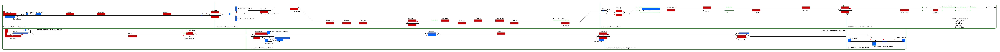

# The Cambrian Line
Simulation of The Cambrian Line, a railway from Shrewsbury (in Shropshire, England) to Welshpool, Aberystwyth and Pwllheli in Wales, UK.

## Current Status

| Stage         | Status        |
| ------------- |:-------------:|
| Track Plan     | :heavy_check_mark: |
| Signalling      | :heavy_check_mark:      |
| Naming | :heavy_check_mark:      |
| Speed Limits | :heavy_check_mark: |
| Distances | :heavy_check_mark: |
| Timetable | :heavy_check_mark: |
| Documentation | :heavy_check_mark: |
